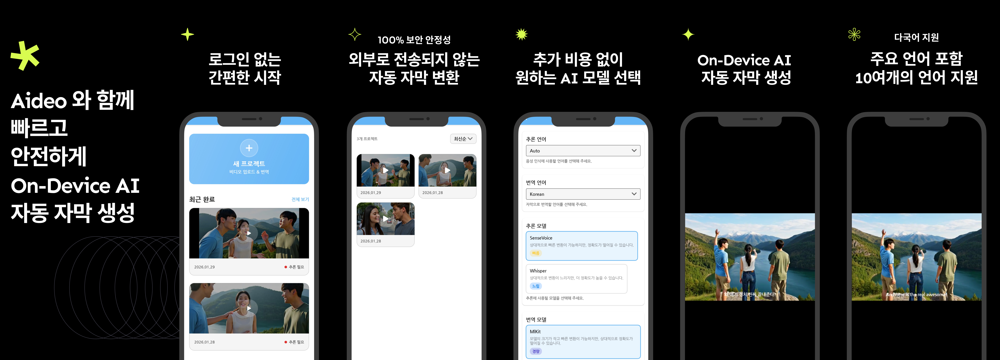

# 개발 기간

2025.12 ~ 2026.02

# 앱 소개

음성 AI 모델들을 활용하여 비디오로 부터 **음성을 추출 · 텍스트 추론 · 번역** 까지의 일련의 작업들을 자동으로 수행시켜주는 앱 입니다.

# 주요 기능

- **자막 생성** : 비디오의 자막을 생성해 주기 위해서 비디오로 부터 `음성을 추출` · 추출된 음성을 AI 모델 입력에 맞게 `전처리` · AI 모델을 활용한 `추론 로직` · 추론 결과인 텍스트를 `.srt` 포맷으로 `후처리` · 원하는 언어로 `번역` · 자막 파일 저장 까지의 `End-to-End Pipeline` 을 구축하고, 이를 사용자에게 간편한 방식으로 제공합니다.

# Stacks

| Category | Skill Set |
| ----- | ----- |
| Language | Kotlin |
| UI toolkit | Compose |
| Architecture | Google-Recommended Architecture |
| Design Pattern | MVVM, MVI |
| Asynchronous | Kotlinx.Coroutines, Kotlinx.Coroutines.Flow |
| Dependency Injection | Hilt |
| Data | DataStore(proto3) |
| Google | InAppPurchase, InAppUpdate, Admob |
| Firebase | Firebase-Analytics, Firebase-Crashlytics |
| CI/CD | Git hooks |

# What Did I Do?

[비디오로 부터 음성을 추출, 텍스트로 추론, 번역 까지의 End-to-End 파이프라인을 구축](documentation/review/비디오_자막_End-to-End_Pipeline_구축.md)

[SOLID 원칙을 기반으로 추론 관련 클래스 설계](documentation/review/SOLID_원칙_적용한_추론_클래스_설계.md)