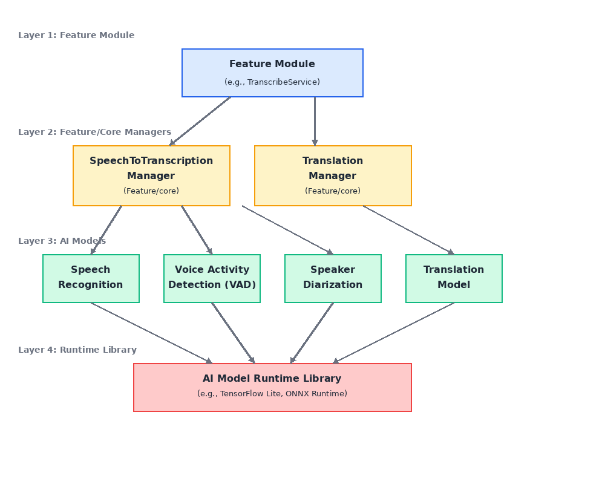

# SOLID 원칙을 적용한 추론 관련 클래스 설계

각 `Feature` 모듈들은 `Feature-Core` 모듈에 존재하는 AI 모델 추론 관련 클래스들을 이용합니다.

추론 관련 전체 클래스 및 의존성 그래프는 다음과 같이 설계합니다.

e.g) 

- `feature/Gallery` 모듈의 TranscribeService 는 자막 추론을 위해 `features/core/SpeechToTranscription` 을 의존
- `SpeechToTranscription` 에서 선택된 음성 AI 모델(Sensevoice/Whisper) 클래스와 SpeakerDiarization, VAD 클래스를 이용하여 `음성 -> 자막 추론` End-to-End Pipeline 을 실행
- TranscribeService 에서 추론 결과를 번역하기 위해 `features/core/Translation` 을 의존
- Translation 에서는 선택된 번역 모델을 이용하여 내부 저장소의 자막 파일을 선택된 언어로 번역한 후, 생성된 번역 파일을 저장합니다.

## 설계 목적

위 의존성 그래프 설계를 통해 다음 목적들을 실현합니다.

1. 단일 책임 원칙(SRP) & 인터페이스 분리 원칙(ISP)

- **AI Category Layer** : `AI Model Category(SpeechToText, Translation etc)` 만의 책임을 갖습니다. 해당 `AI Model Category` 를 실현하기 위해 필요한 AI 모델들을 의존합니다. Manager 클래스는 `AI Model Category` 를 실현하기 위해 필요한 변경사항 외에는, 내부 구조의 변경이 일어나지 않습니다.
- **AI Model Layer** : 특정 `AI Model(SenseVoice, Whisper, Silero-VAD etc)` 만의 책임을 갖습니다. 특정 `AI Model` 의 입출력 구조와 같은 구체적 정보가 변경하지 않는 한, 내부 구조의 변경이 일어나지 않습니다.
- **추론 Runtime Library Layer** : AI Model 의 특정 Format(Onnx, LiteRT) 을 읽고, 이해 할 수 있는 `추론 Runtime Library(Onnx-Runtime)` 만의 책임을 갖습니다. `추론 Runtime Library` 의 버전 변경으로 인한 내부 변경이 일어나지 않는 한, 이 클래스의 변경이 일어나지 않습니다.

각 Layer 의 클래스와 인터페이스들이 변경의 원인이 하나로 축소됨으로써(액터가 하나) 복잡도를 줄일 수 있었습니다.

2. 개방-폐쇄 원칙(OCP)

개방-폐쇄 원칙의 핵심은 가장 변할 가능성이 적은 컴포넌트를 중심으로 의존성 방향을 설계해야 한다는 점입니다. 

이 원칙을 근거로 가장 변경될 가능성이 적은 `[Onnx Native Runtime Library < AI 모델 클래스 < AI Category Layer < Feature]` 방향으로 의존성을 설계했습니다.

유지보수 관점에서 추론 Runtime Library 는 고정 버전을 사용하여 변경의 가능성이 가장 적으며, 상위 버전으로 업데이트를 염두하여 캡슐화를 통해 최대한 외부 요소를 그대로 드러내지 않도록 하였습니다. AI 모델 클래스의 경우 고정된 버전으로 배포된 후 새로운 모델이 발생하는 구조 이기 때문에 모델 자체의 변경 가능성이 없다고 봐도 무방합니다. 하지만, 기능을 확장할 때 새로운 AI 모델이 추가될 수 있으므로 추론 Runtime Library 보다는 변경의 가능성이 큽니다.

AI Category Layer 는 새로운 기능을 추가하거나, 신규 AI 모델을 추가할 때 마다 영향을 받기 때문에 AI Model 클래스 보다 변경의 가능성이 더 큽니다. 그리고 Feature Layer 는 AI 관련 기능과 무관하게 변경의 가능성이 있으므로 AI Category Layer 보다 변경의 가능성이 더 많습니다.

이 구조의 장점은 기능을 추가 및 확장하거나 유지보수 하는 과정에서 변경에는 닫혀있고 확장에 열려있도록 만든다는 것 입니다. 구체적으로 다음과 같은 장점을 얻을 수 있었습니다.

1. **전략 패턴(Strategy Pattern)** : 같은 AI Category 내에서 새로운 AI 모델을 추가하는 경우, AI Model Interface 를 구현하는 새로운 구현체를 생성하여 주입함으로써 변경이 아닌 확장이 수행됩니다.
2. **퍼사드 패턴(Facade Pattern)** : 새로운 AI Category 를 정의하더라도, 이미 만들어져 있는 AI 모델 클래스를 필요한 만큼 주입 받음으로써 기능을 쉽게 추가할 수 있습니다. 또한, Feature Layer 에서 새로운 AI 기능을 만들 때도 AI Category Layer 에서 필요한 Manager 클래스들을 주입 받음으로써 기능을 쉽게 추가할 수 있습니다.

3. 리스코프 치환 원칙(LSP)

LSP는 고수준의 계약을 저수준이 이행해야 한다는 원칙으로, 이 원칙의 핵심은 잘 설계된 추상화 입니다.  

잘 설계 되지 못한 추상화는 구현체를 생성할 때 변경 사항을 야기하고, 이것이 구현되는 다른 모든 클래스에 영향을 미칩니다. 

이를 방지하기 위해, 먼저 앱에서 필요로 하는 핵심 기능을 명확히 설정합니다. 이를 기반으로 핵심 기능을 실현하기 위한 명확한 책임을 나눕니다.

나뉘어진 명확한 책임을 기반으로 추상화(고수준에서 필요한 핵심 기능을 설정)한 뒤에 이를 구체화 하는 과정을 거쳤습니다.

위 과정을 수행하여 설계된 클래스 구조는 다음과 같습니다.

앱에서 필요로 하는 핵심 기능은 `비디오의 자동 자막 생성` 입니다. 요구사항이 복잡하기 때문에 3가지의 작은 문제로 나눕니다.

1. 비디오로 부터 음성을 추출
2. 추출된 음성을 텍스트로 추론
3. 추론 결과를 번역 및 저장

해당 책임을 기반으로 4가지의 고수준 Component 에 대해 각각의 핵심 기능 추상화 합니다.

1. **MediaFileManager** : 앱 내의 비디오를 가져오거나, 비디오로 부터 음성을 추출하는, __Media와 관련된 핵심 기능을 수행하는 클래스__ 입니다.
2. **AI 모델** : AI 모델의 입·출력 구조에 맞게 __전·후 처리__ 를 수행하고, 모델의 아키텍처에 따라 분할된 여러 모델을 직렬로 트리거하는 클래스 입니다.
3. **추론 Runtime Library** : AI Model 의 특정 Format 을 읽고, 이해할 수 있는 `추론 Runtime Library` 의 필요한 기능들을 캡슐화 하는 클래스 입니다. 모델의 초기화, 리소스 해제, 추론을 직접 실행합니다.

이후, 3가지 Component 를 기반으로 핵심 기능을 구현하기 위한 각 구현체 클래스들을 생성하였습니다.

- MediaFileManager(Interface)
  - AndroidMediaFileManager(Impl)
- SpeechRecognition(Interface)
  - SenseVoice(Impl)
  - Whisper(Impl)
- Translation(Interface)
  - MLKit(Impl)
  - M2M100(Impl)

그리고 **AI Category** 컴포넌트를 생성합니다. 이는 설명한 바와 같이, 필요한 AI 모델들을 주입 받아, 실현하고자 하는 목적을 구현하는 Manager 클래스 입니다. 예를 들어, SpeechRecognition, VAD, SpeakerDiarization 의 특정 클래스들을 주입받아 SpeechToTranscription(`음성 -> 텍스트 추론(SpeechToText)`) AI Category를 구현합니다.

- SpeechToTranscription
- TranslationManager

4. 의존성 역전 원칙(DIP)

DIP 역시 LSP 와 마찬가지로 추상화가 핵심입니다. 객체가 구현체를 직접 의존하지 말고, 추상화된 고수준의 컴포넌트를 의존하라는 원칙입니다. 이를 **의존성 주입 개념**과 함께 활용하여 **OCP** 를 만족시킬 수 있었고, 궁극적으로 **유지보수 용이성**과 **확장성**을 높일 수 있을 뿐만 아니라 테스트 가능성까지 확보할 수 있었습니다.

- **MediaFileManager** : 기기 내부의 `Media File I/O` 을 다룹니다. 이는 Platform 의존성(Android 의 경우 MediaCodec)이 강하며, 특정 Platform 에서 필요한 구현체를 주입받기 위해 추상화 됩니다. 따라서, 기기 내부의 Media File I/O 가 필요한 경우 구체적인 AndroidMediaFileManager 를 의존하는 것이 아닌, MediaFileManager 를 의존하고 구현체는 주입받음으로써 확장성을 높입니다.
- **AI 모델** : 이는 구체적인 AI 모델의 의존성이 강합니다. 특정 `AI Model Category Manager` 에서 필요한 AI 구현체 모델을 주입받을 수 있도록 추상화 합니다. 따라서, SpeechToTranscription 에서는 SpeechRecognition 을 수행하기 위해 구현체(SenseVoice or Whisper)를 필요에 따라 주입 받아 사용함으로써 확장성을 높입니다.
- **AI Model Runtime Library** : 이는 AI Model 의 특정 Format 에 의존성이 강합니다. 특정 AI Model 이 어떤 Format(Onnx, LiteRT, etc) 으로 생성되었는가에 따라 필요한 `추론 Runtime Library` 를 주입 받습니다.

의존성 역전 원칙을 활용함에 따라 기능이 확장되면서 추가되는 AI 모델들에 대해 기존의 코드를 변경할 이유가 없어졌습니다. 새로운 AI 모델이 추가되는 상황에서도 새로운 구현체를 만들어 주입하기만 하면 기존의 코드를 그대로 재 사용할 수 있었습니다.