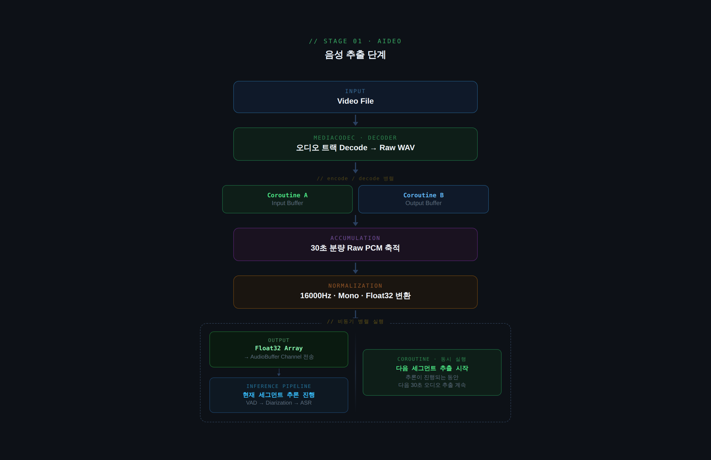
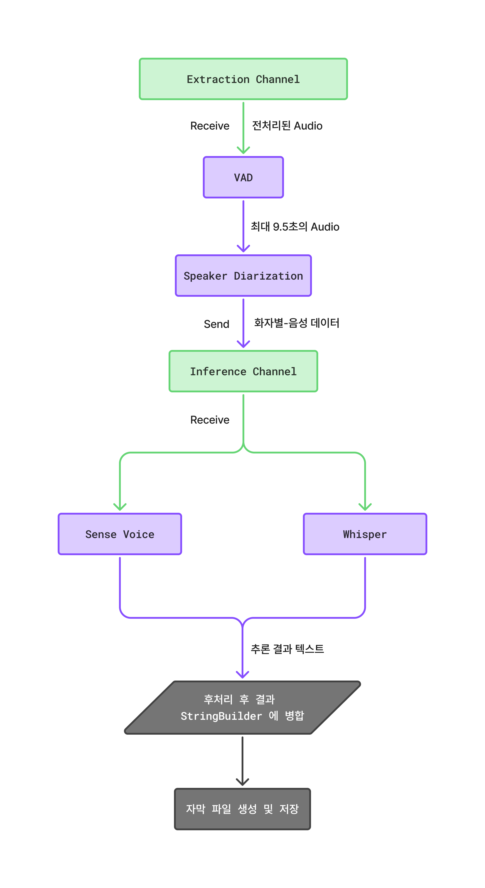
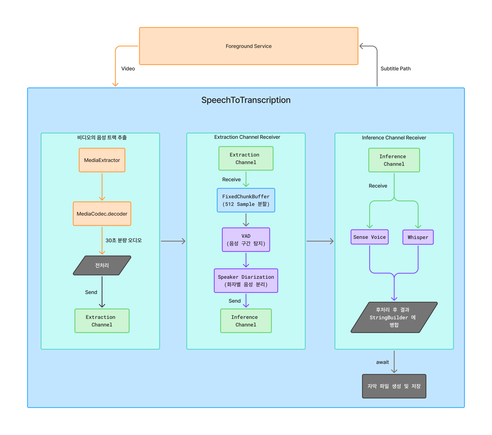
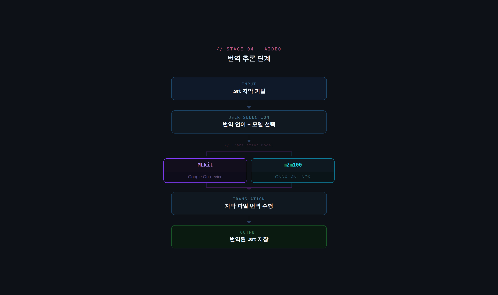

# 비디오 -> 자막 번역 End-to-End Pipeline 구축

Aideo 앱을 개발하면서 비디오로 부터 음성을 추출 · 전처리 · 텍스트 추론 · 후처리 · 번역 · 저장 까지의 `End-to-End Pipeline` 구축과 관련된 세부 사항들을 자세히 review 해보겠습니다.

## 음성 추출 단계

추출 파이프라인을 단순화한 결과는 다음과 같습니다.

비디오의 음성트랙을 추출하기 위해서는 `MediaCodec` 활용하였습니다. `Media3.Transformer` 를 활용할 수도 있지만, 저의 경우 비디오로 부터 음성 트랙을 `원시 오디오(WAV)` 포맷으로 추출해야 했는데, `Media3.Transformer` 는 `WAV` 포맷으로의 변환을 지원하지 않아 `MediaCodec` 을 직접 이용하였습니다.

`MediaCodec` 을 `Decoder` 로 이용하여, 인코딩된 비디오의 오디오 트랙을 원시 오디오 데이터(WAV)로 decode 한 후, 30초 분량의 오디오를 축적하여 추론 모델의 입력 구조에 맞게 Normalization 을 수행합니다. 해당 과정에서의 Key Point 는 두가지 입니다.

1. **메모리 재 할당 Overhead 를 줄이기 위해 배열을 활용** : (SampleRate * Channel 수 * byte 수 * 초) 를 토대로 30초(추론 모델의 최대 입력 길이) 분량의 원시 오디오 길이 크기의 배열을 생성하여, Normalization 한 결과를 추론 채널로 전송합니다. 이 과정에서 불 필요하게 메모리 공간을 재 할당하지 않아, Garbage Collection 이 빈번하게 실행되지 않도록 만들어 성능을 최적화 합니다.
2. **비동기 실행으로 성능 최적화** : `음성->텍스트 추론`에 병목 현상이 있어, '추출'과 '추론' 작업을 `Coroutine` 으로 나눈 뒤 비동기 실행하여 최적화 합니다.

## 음성->텍스트 추론 단계

빠른 개발을 위해 `음성->텍스트` 추론에 샤오미에서 develop 및 maintaining 하는 Onnx 기반의 `음성 AI 추론 런타임 통합 라이브러리` [sherpa-onnx](https://github.com/k2-fsa/sherpa-onnx) 을 활용합니다.

`sherpa-onnx` 를 이용하여 앱 내에서 활용하는 음성 AI 모델은 다음과 같습니다.

- **Silero-VAD** : VAD(Voice Activity Detection: 음성 활동 감지) 모델로 **유효 음성 길이 추출**
- **pyannote-segmentation-3.0** : Speaker Diarization(화자 분리) 의 segmentation 모델
- **3d-speaker-embedding** : Speaker Diarization 의 embedding 모델
- **SenseVoice** : Speech Recognition(음성 -> 텍스트 추론)
- **Whisper** : Speech Recognition
- **Punctuation** : 구두점 삽입(중국어만 지원)

### 음성 -> 자막 생성 파이프 라인 구축

`음성 -> 자막 생성` 까지의 Pipeline 을 단순화한 결과는 다음과 같습니다.

1. Normalized Audio Float Array 수신 대기
2. `Silero-VAD` 로 오디오에서 최대 9.5초 분량의 음성을 감지
3. 유효 음성 길이를 그대로 `Speech Recognition` 하면, 동 시간대의 자막 길이가 너무 길기 때문에 분할을 위한 `Speaker Diarization` 을 수행
4. 분할된 `화자별-음성`을 사용자에 의해 선택된 `Speech Recognition` 모델(SenseVoice/Whisper)로 Text 추론
5. 각 추론 결과를 StringBuilder 로 병합
6. 1~5 과정 반복하여 추론 완료시 `.srt` 생성 및 내부 저장소에 저장

## End-to-End Pipeline Details

`음성추출 -> 자막 생성` 까지의 전체 End-to-End Pipeline 을 단순화한 결과는 다음과 같습니다.

End-to-End Pipeline 은 추론 소요 시간이 길기 때문에 `ForegroundService` 에서 실행되며, 3가지 작업 단위로 분할한 파이프라인으로 수행합니다.

- 비디오의 음성 트랙 추출 : MediaCodec 의 decoder 로 raw 음성 데이터를 30초 분량씩 모아, `16000 Sample Rate & Mono Channel & Float32 type` 으로 변환한 후 AudioBuffer Channel 로 전송
- AudioBuffer Channel : `VAD` 입력 구조에 맞게 WindowSize(512) 만큼 Audio 를 분할 -> `VAD` 실행 -> `Speaker Diarization` 실행 -> `화자별-음성` Mapped Audio 를 Inference Channel 로 전송
- Inference Channel : `화자별-음성` Mapped Audio 를 `Speech Recognition` 실행 후 StringBuilder 에 append

작업 수행에 소요되는 시간은 `SpeechRecognition` > `Vad & Speaker Diarization` > `Audio Extraction` 순으로 소요됩니다. 따라서, 작업 별 병목 현상을 3가지 단계로 나뉜 파이프라인을 구축하여 비동기 실행함으로써 최적화 합니다.

`SpeechRecognition` 추론까지 완료되면, StringBuilder 의 char 들을 String 으로 변환하여 `.srt` 자막 파일 생성 및 내부 저장소에 저장합니다.

## 번역 추론 단계

자막 번역 추론 단계를 단순화한 결과는 다음과 같습니다.

자막이 생성된 후, 사용자의 선택된 언어로 번역을 수행합니다. 자막 파일의 번역을 위해 앱에서는 `MLkit` 과 facebook 의 `m2_m100` 모델을 활용합니다. `MLkit` 은 가이드에 따라 코드를 작성했습니다.

`sherpa-onnx` 은 음성 관련 모델만 지원하기 때문에, sherpa-onnx 에서 이미 활용하고 있는 onnx-runtime native library 를 이용하여 `m2m100` 모델의 추론 로직을 작성하였습니다. cpp 코드의 이해가 없는 상태라 AI 를 최대한 활용하여 작성한 후, 코드의 논리성 및 효율성을 기준으로 review -> update 과정을 거쳤습니다. 

이후 ndk 빌드를 위한 CMake 스크립트를 작성하고, JNI Wrapper 클래스를 생성하여 통합 하였습니다.

결과적으로 자막 추론 직후 그리고 비디오 플레이어 화면내에서 사용자에 의해 선택되어진 번역 언어 및 번역 모델(MLkit/m2m100)로 자막 파일의 번역을 수행 및 저장합니다.
