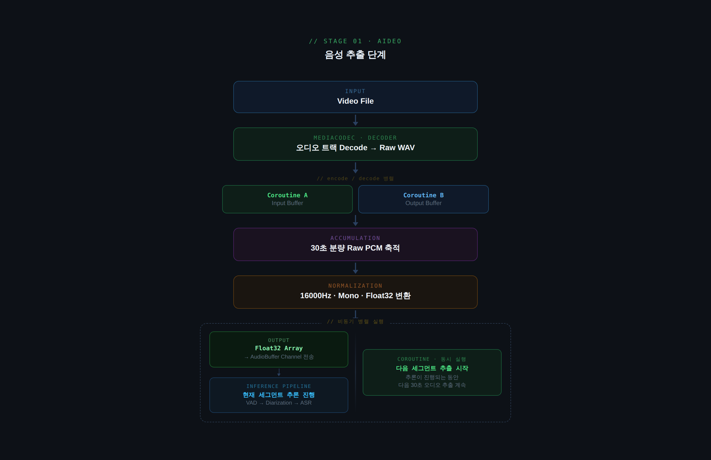
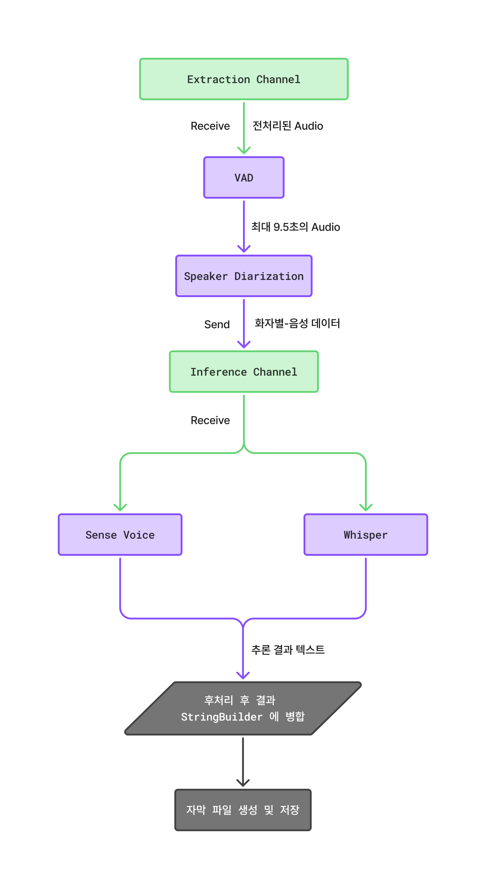
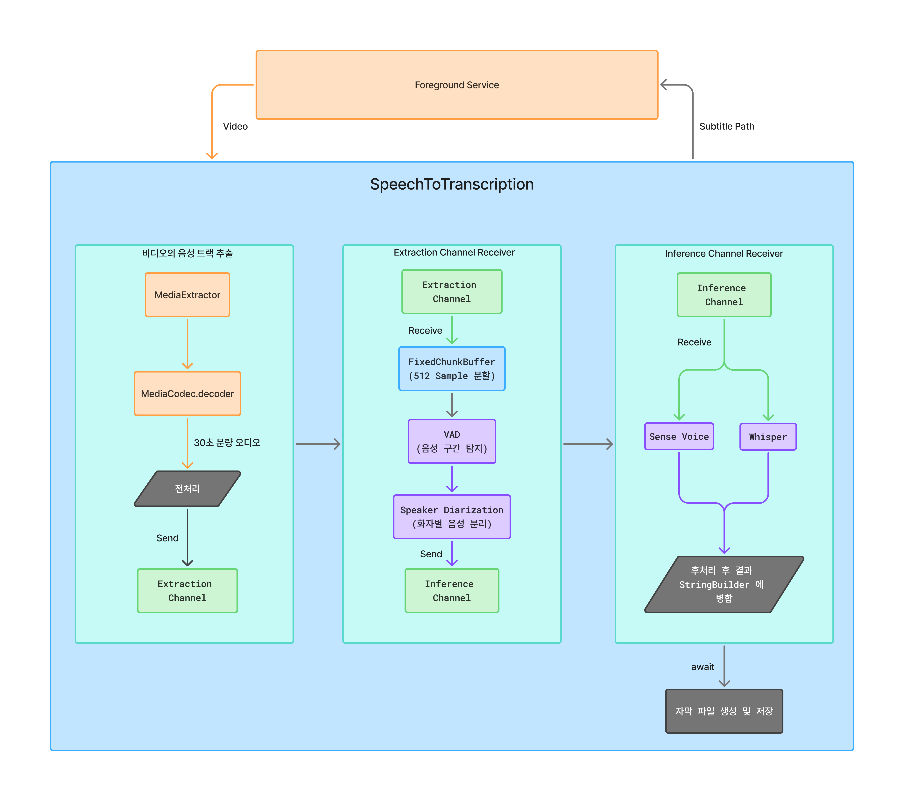
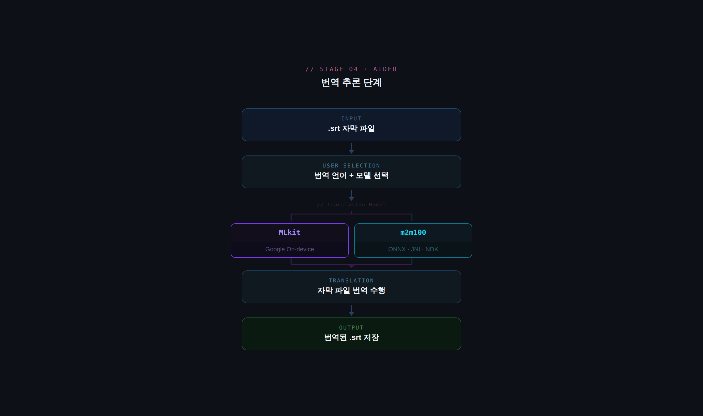

# 비디오의 음성 추출 → 텍스트 추론 → 번역까지의 End-to-End 파이프 라인을 구축

## 1. 음성 추출 단계

추출 파이프라인을 단순화한 결과는 다음과 같습니다.

비디오의 음성트랙을 추출하기 위해서는 `MediaExtractor` 와 `MediaCodec` 을 활용하였습니다. `Media3.Transformer` 를 활용할 수도 있지만, 저의 경우 비디오로 부터 음성 트랙을 `원시 오디오(WAV)` 포맷으로 추출해야 했는데, `Media3.Transformer` 는 `WAV` 포맷으로의 decode를 지원하지 않아 `MediaExtractor` 와 `MediaCodec` 을 직접 이용하였습니다.

먼저, `MediaExtractor` 로 비디오의 음성 트랙을 추출합니다. 그리고 `MediaCodec` 을 `Decoder` 로 이용하여, 인코딩된 비디오의 오디오 트랙을 원시 오디오 데이터(WAV)로 decode 한 후, 30초 분량의 오디오를 축적하여 추론 모델의 입력 구조에 맞게 전처리를 수행 합니다.

해당 과정에서의 Key Point 는 두가지 입니다.

1. **불 필요한 메모리 할당을 하지 않기 위해 전역 공간에 Arrays 생성 및 재사용** : (Sample Rate * Channel 수 * byte 수 * 초) 를 토대로 30초(추론 모델의 최대 입력 길이) 분량의 원시 오디오 길이 크기의 배열을 전역 공간에 생성 및 재사용합니다. 배열의 경우 boxing type 을 사용하지 않는 kotlin의 arrays 를 활용합니다. 결과적으로, 최대한 불 필요한 메모리 할당 없이 값만 복사 함으로써 메모리 효율성과 성능을 개선하였습니다.
2. **병렬 파이프라인 구축** : '음성->텍스트 추론'을 하나의 스레드에서 순차처리 하는 것은 느립니다. 따라서, '추출'과 '추론' 작업을 `Coroutine` 으로 나눈 뒤, `Coroutines.Channel` 을 활용한 병렬 파이프라인 처리로 개선하였습니다.

## 2. 음성->텍스트 추론 단계

빠른 개발을 위해 `음성->텍스트` 추론에 샤오미 소속 개발자들이 develop 및 maintaining 하는 Onnx 기반의 `음성 AI 추론 런타임 통합 라이브러리` [Sherpa-Onnx](https://github.com/k2-fsa/sherpa-onnx) 을 활용합니다.

`Sherpa-Onnx` 를 이용하여 앱 내에서 활용하는 음성 AI 모델은 다음과 같습니다.

- **Silero-VAD** : VAD(Voice Activity Detection: 음성 활동 감지) 모델로 **유효 음성 길이 추출**
- **pyannote-segmentation-3.0** : Speaker Diarization(화자 분리) 의 segmentation 모델
- **3d-speaker-embedding** : Speaker Diarization 의 embedding 모델
- **Sense Voice** : Speech Recognition(음성 -> 텍스트 추론)
- **Whisper** : Speech Recognition
- **Punctuation** : 구두점 삽입(중국어만 지원)

### 2-1. 음성 -> 자막 생성 파이프 라인 구축

`음성 -> 자막 생성` 까지의 Pipeline 을 단순화한 결과는 다음과 같습니다.

1. 전처리된 Audio Float Array 수신 대기
2. `Silero-VAD` 로 오디오에서 최대 9.5초 분량의 음성을 감지
3. 유효 음성 길이를 그대로 `Speech Recognition` 하면, 동 시간대의 자막 길이가 너무 길기 때문에 분할을 위한 `Speaker Diarization` 을 수행(화자별-음성 반환)
4. 분할된 `화자별-음성`을 사용자에 의해 선택된 `Speech Recognition` 모델(Sense Voice/Whisper)로 Text 추론
5. 각 추론 결과를 StringBuilder 로 병합
6. (1~5) 과정 반복하여 추론 완료시 자막 파일(`.srt`) 생성 및 내부 저장소에 저장

### 2-2. End-to-End Pipeline Details

`음성추출 -> 자막 생성` 까지의 전체 End-to-End Pipeline 을 단순화한 결과는 다음과 같습니다.

End-to-End Pipeline 전체 추론 소요 시간이 길기 때문에 `Foreground Service` 에서 실행합니다. 또한, `Speech Recognition` > `Vad & Speaker Diarization` > `Audio Extraction` 순서대로 추론 과정이 오래 소요되는 특성을 반영하여 각 단계를 `Coroutine & Channel` 로 병렬 실행하는 파이프라인을 구축하여 성능을 개선했습니다.

- **비디오의 음성 트랙 추출** : MediaCodec 의 decoder 로 raw 음성 데이터를 30초 분량씩 모아, `16000 Sample Rate & Mono Channel & Float32 type` 으로 전처리한 후 Extraction Channel 로 전송
- **Extraction Channel Receiver** : VAD 입력 구조에 맞게 Window Size(512 Samples) 만큼 Audio 를 분할 -> VAD 실행 -> Speaker Diarization 실행 -> `화자별-음성` Mapped Audio 를 Inference Channel 로 전송
- **Inference Channel Receiver** : `화자별-음성` Mapped Audio 를 Speech Recognition 실행 후, 후처리 한 텍스트들을 StringBuilder 에 append

`SpeechRecognition` 추론까지 완료되면, StringBuilder로 병합된 문자들을 String 으로 변환하여 `.srt` 자막 파일 생성 및 내부 저장소에 저장합니다.

`음성 -> 자막 생성` End-to-End Pipeline 구축 과정의 핵심 Key point 는 다음과 같습니다.

- 메모리 효율성 및 성능 개선
- End-to-End Pipeline 취소

위 과정들에서 발생한 문제들에 대해 사용자 관점에서 분석한 뒤, 해결 방법들을 적용하였습니다.

### 2-3. 메모리 효율성 및 성능 개선

비디오로 부터 추출된 음성을 자막으로 추론 하는 과정에서는 `Speech Recognition` 뿐만 아니라, 정확도를 위한 `Vad`, `Speaker Diarization` 추론을 먼저 수행합니다. 이 때, 비디오로 부터 음성 추출과 추론 작업을 나눈 맥락과 같이, `Speech Recognition` 추론이 `Vad & Speaker Diarization` 추론 보다 더 느리기 때문에 발생하는 병목 현상을 개선하기 위해 `Coroutine` 으로 두 단계를 나누고, `Channel` 을 활용한 병렬 처리 파이프라인을 구축하여 성능을 개선하였습니다.

이외에 `음성 -> 자막 생성`에서 집중한 부분들은 다음과 같습니다.

- **추론 로딩 속도 개선** : Vad, Speaker Diarization, Speech Recognition 추론 관련 인스턴스의 초기화 과정에 걸리는 시간은 약 5~10초가 소요될 수 있어 매번 사용자에 의해 추론이 트리거될 때 마다 초기화를 하게 되는 것은 사용자 경험이 저해됩니다. 따라서 추론 관련 인스턴스들을 유지하고, 다음 추론에 재 사용하는 방법을 적용했습니다.
- **메모리 효율성 개선** : 추론 로딩 속도 개선을 위해 항상 추론 관련 인스턴스들이 네이티브 메모리 공간에 유지되는 것은 메모리에 부담이 될 수 있습니다. 사용자 중심의 관점에서 이 문제를 바라볼 때, 앱이 Foreground 에 있다면 사용자는 다음 동영상의 추론을 실행할 가능성이 클 뿐만 아니라, 프로세스 우선 순위 계층상 LMK 의 최후의 타겟이기 때문에 인스턴스를 유지합니다. 반면에, 앱이 Background 에 있다면 나뉘어진 각 단계가 종료될 때 메모리에서 제거되도록 release 합니다. 또한, 메모리 부담을 줄이기 위해 음성 추출 단계에서 적용했던 '불 필요한 배열 공간 할당'을 피하고, 'primitive type Arrays'를 이용합니다.

또한, 앱이 Background 로 내려가고 Foreground Service 가 활성화 중이면 메모리가 부족한 상황이 발생하는 경우 LMK 에 의해 프로세스가 종료될 수 있습니다. 이 경우 사용자 경험 저해를 방지하기 위해 `START_STICKY` 값을 반환하도록 설정하고, 각 추론 작업 시작 때 디스크에 캐싱 된 비디오의 contentURI 값으로 비디오의 자막 생성 End-to-End Pipeline 을 재 실행하도록 구현했습니다.

### 2-4. End-to-End Pipeline 취소

사용자는 `비디오 -> 자막 생성` 작업을 실행하고, Foreground Service 의 Notification 을 통해 취소할 수 있습니다. 또한, 실행중인 추론이 끝나기 전에 다른 비디오의 자막 생성을 실행하는 경우 기존의 작업을 취소하고 다음 작업을 실행할 수 있습니다.

- **추론 완료 전, 새로운 추론을 실행 하는 경우** : 캐싱 된 이전의 Job 을 취소한 뒤, 새로운 Coroutine 을 생성 및 시작합니다. 이 때, 각 추론 인스턴스들을(Speech Recognition, Vad, Speaker Diarization) 새롭게 Initialize 하지 않고, 기존의 인스턴스를 재 사용 함으로써 최적화 합니다.
- **추론 완료 전, 현재의 추론을 취소하는 경우** : 캐싱 된 Coroutine 의 Job 을 취소하고, 완전히 종료될 때 까지 대기(cancelAndJoin) 합니다. 완전히 종료된 후, 추론 관련 인스턴스들을 앱이 Background 인 경우 release 합니다.

두가지 시나리오의 핵심은 추론을 실행 할 `Coroutine` 을 생성할 때 마다, Job 을 캐싱 해두고 완전히 종료된 후 다음 동작을 실행하는 것 입니다. 캐싱된 이전의 `Coroutine` 이 종료되기 전에, 동작을 수행할 경우 실행 중인 `Coroutine` 내의 추론 과정에서 잘못된 메모리를 참조하는 오류가 발생하기 때문에 이 조건을 엄격하게 제어 했습니다.

## 3. 번역 추론 단계

자막 번역 추론 단계를 단순화한 결과는 다음과 같습니다.

자막이 생성된 후, 사용자의 선택된 언어로 번역을 수행합니다. 자막 파일의 번역을 위해 앱에서는 `MLkit` 과 facebook 의 `M2M-100` 모델을 활용합니다. `MLkit` 은 가이드에 따라 코드를 작성했습니다.

`sherpa-onnx` 은 음성 관련 모델만 지원하기 때문에, sherpa-onnx 에서 이미 활용하고 있는 onnx-runtime native library 를 이용하여 `M2M-100` 모델의 추론 로직을 작성하였습니다. 첫 앱 배포 당시에는 c++ 코드의 이해가 없는 상태라 AI 를 최대한 활용하여 작성한 후, 코드의 논리성 및 효율성을 기준으로 review -> update 과정을 수행 했습니다. 현재는 C++ 학습을 병행하며, 기존 코드 개선과 동시에 단계적으로 Sherpa-onnx 를 자체 Native Library 로 변환중에 있습니다.

마지막으로 ndk 빌드를 위한 CMake 스크립트를 작성하고, JNI Wrapper 클래스를 생성하여 통합 하였습니다.